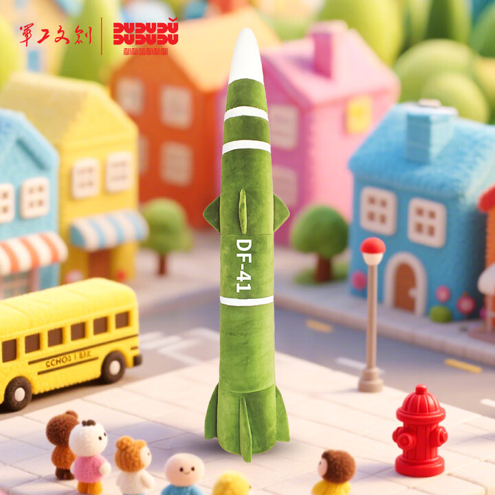

---

中华民族已经屹立于地球上几千年。无论是自然灾害、还是外族入侵，中华儿女团结一致，从来没有被任何困难所打倒。中华人民热爱和平，但前途是光明的，道路是曲折的。帝国主义的奸细们潜伏于我们周围，使用糖衣炮弹制造矛盾，妄图瓦解我们。他们的阴谋不会得逞，他们的诡计终将失败。一切反动势力都是纸老虎，必须被坚决、完全、彻底地消灭干净。

The Chinese nation has stood erect on the earth for many thousands of years. Be it a natural disaster or a foreign invasion, sons and daughters of China stay united, never defeated by any difficulties. The Chinese people love peace; while the future is bright, the way is tortuous. Imperialist lackeys are lurking around us, ready to create conflicts with sugar-coated bombs, to dissolve us. They will never gain triumph; their plots will inevitably fail. All reactionary forces are paper tigers, which must be annihilated firmly, totally, and completely.
